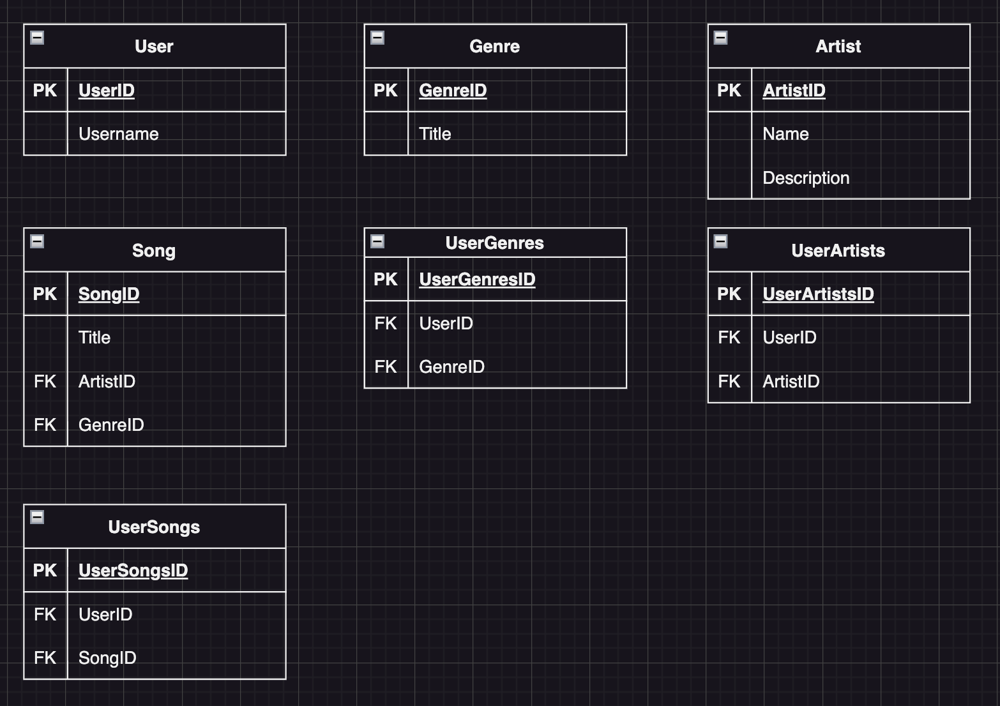

# Music Interest Tracker

## Endpoints

- `https://localhost:7216/seed` - Seed the database with data from **_Last.fm_**
- `https://localhost:7216/user` - Create a new user

  ```json
  {
    "username": "username"
  }
  ```

- `https://localhost:7216/users` - Get all users
- `https://localhost:7216/user/song` - Add a song to a user's list

  ```json
  {
    "title": "song title"
  }
  ```

- `https://localhost:7216/user/genre` - Add a genre to a user's list

  ```json
  {
    "title": "genre title"
  }
  ```

- `https://localhost:7216/user/artist` - Add an artist to a user's list

  ```json
  {
    "name": "artist name"
  }
  ```

- `https://localhost:7216/user/songs` - Get all songs for a user
- `https://localhost:7216/user/genres` - Get all genres for a user
- `https://localhost:7216/user/artists` - Get all artists for a user
- `https://localhost:7216/songs` - Get all songs
- `https://localhost:7216/genres` - Get all genres
- `https://localhost:7216/artists` - Get all artists

## ER-diagram


